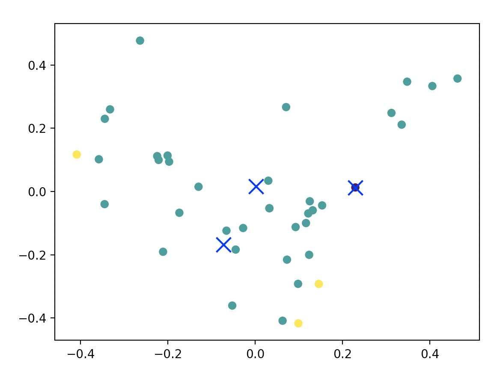

# cMapKMeans
### By Henry Manley
Given a list of statements, number of participants, and participant demographics, cMapKMeans auto-generates a Concept Mapping xlsx to be passed into the cMAP R
library. The returned data set is titled "sortData.xlsx", which is defined by parameters set in "globals.py" and user-generated statements made in "statements.xlsx".

## The Procedure
<ul>
<li> Perform KMeans clustering on statements for each participant
<li> Map cluster assignment to each statement
<li> Iterate through participants and generate master sort data
<li> Reshape and clean the data for cMAP
</ul>

## Set Up
After cloning the repo and opening the respective directory, in the command line, paste: `pip install -r requirements.txt`. Then paste `python autoSort.py` to run the program. Open "sortData.xlsx" to find auto-generated sort data as specified by "globals.py". Change "globals.py" file to change the sort of the statements in "statements.xlsx".

## How to Use
Open and edit "globals.py" to include the following parameters:

`stakeholder1` First stakeholder (eg. "Employees") 
`stakeholder2` Second stakeholder (eg. "Board Members") 
`participants` Number of participants providing statements. (eg. 5) 
`maxClusters` Maximum number of piles one could sort statements into. (eg. 10) 
`rating1` First rating item for each statement (eg. "Feasibility") 
`rating2` Second rating item for each statement (eg. "Importance") 
`rateMax` Rating scale for each item [1..rateMax] (eg. 5) 

Open and edit "statements.xlsx" to include the statements you want sorted.

## Concept Mapping
<ul>
<li> Bar, Haim, and Lucas Mentch. 2017. “R-Cmap‚ an Open-Source Software for Concept Mapping.” Evaluation and Program Planning 60: 284–92. doi:10.1016/j.evalprogplan.2016.08.018.
<li> Davison, M. L. (1983). Multidimensional Scaling. New York, NY: John Wiley & Sons, Inc. (specific sections)
<li> Trochim, William M., and Daniel McLinden. 2017. “Introduction to a Special Issue on Concept Mapping.” Evaluation and Program Planning 60: 166–75. doi:https://doi.org/10.1016/j.evalprogplan.2016.10.006.
</ul>
